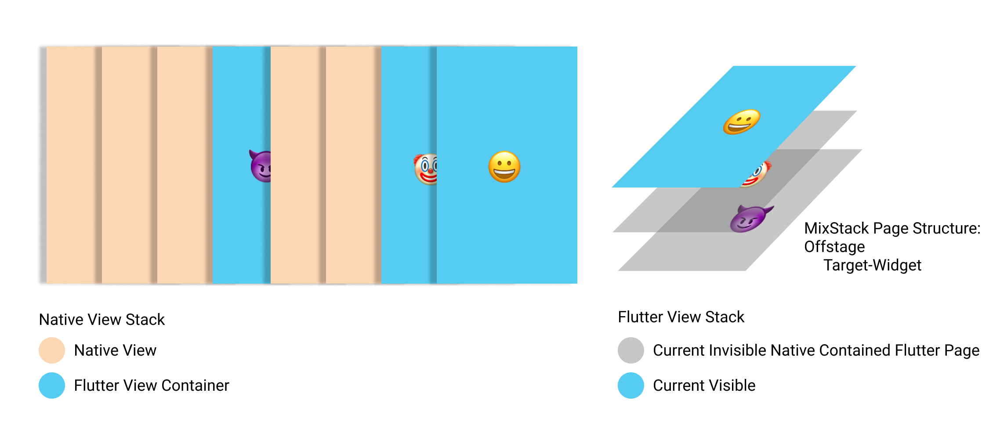
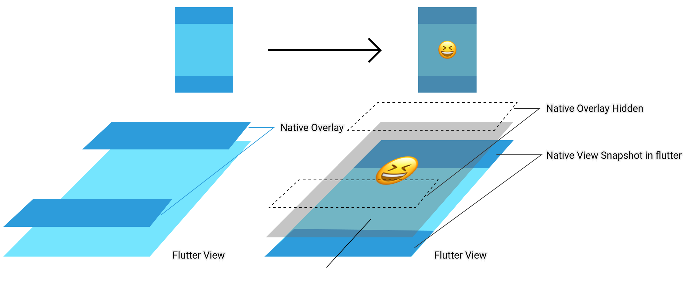

[English README](README_en.md)

# MixStack 混合栈

MixStack 让你能够无痛接入 Flutter，提供包括多 Tab Flutter View 支持，动态 Tab 变化 （Flutter 对应页面状态持久化），原生界面与 Flutter 相融合等能力。尽享 Flutter 的流畅与高效。

## MixStack基础结构



如图所示，MixStack 中每一个 Native Flutter Container，都包含了一个独立的 Navigator 维持 Flutter 内栈管理，通过 Flutter 内 Stack 控制当前渲染 Native Container 所属的 Flutter 页面栈。通过这样，Flutter 和 Native 的导航，以及各种 View 交互都成为了可能。

## 开始接入

混合开发有时候会有点复杂，请来点耐心。

### 安装

pubspec.yaml 中添加 mix_stack 依赖

```yaml
dependencies:
  mix_stack: <lastest_version>
```

Flutter 目录下执行 ```flutter pub get```

iOS 目录下执行 ```pod install```

Android 在`build.gradle`中加入

```gradle
implementation rootProject.findProject(":mix_stack")
```

## 如何接入

### Flutter 端

找到 Flutter 项目的根 Widget，在第一个页面的位置将 MixStackApp 注入进去,将你所用路由的 route 结果作为回调结果传回 MixStackApp，如以下示例：

```dart
class MyApp extends StatelessWidget {
  void defineRoutes(Router router) {
    router.define('/test', handler: Handler(handlerFunc: (ctx, params) => TestPage()));
  }

  @override
  Widget build(BuildContext context) {
    defineRoutes(router);
    return MixStackApp(routeBuilder: (context, path) {
      return router.matchRoute(context, path).route; //传回 route
    });
  }
}
```

MixStack Flutter 部分接入到此完成了。具体使用请参考[Flutter使用详解](#Flutter端使用详解)

### iOS 端

FlutterEngine 执行 Run 后，将 Engine 设置到 MXStackExchange 上。

```objc
//AppDelegate.m
[flutterEngine run];
[MXStackExchange shared].engine = flutterEngine;
```

MixStack iOS 部分接入到此完成了。具体使用请参考[iOS使用详解](#iOS端使用详解)

### Android 端

确保在 Application onCreate()` 中执行：

```java
MXStackService.init(application);
```

MixStack Android 部分接入到此完成了。具体使用请参考[Android使用详解](#Android使用详解)

## Flutter端使用详解

### Flutter 端对当前容器内 Navigator 进行监听

如果需要对单个容器内 Navigator 进行监听，可以在初始化时额外添加 Observers Builder

```dart
MixStackApp(
      routeBuilder: (context, path) {
        return router.matchRoute(context, path).route;
      },
      observersBuilder: () {
        return [CustomObserver()];
      },
    )
```

### Flutter 端控制 Native 界面隐藏显示

当你的 Flutter 容器额外含有某些 Native View 时，如果你想在 Flutter 内 push 一个页面，你可能需要让原生页面看起来被盖住了，如下图所示


我们为此提供了一个 Flutter 端控件 NativeOverlayReplacer 供你方便的完成这个目的.
当你的页面有这个需求时，你只需要在页面根部拿 NativeOverlayReplacer 包住，并填入希望自动隐藏的 Native Overlay 名字即可

```dart
@override
Widget build(BuildContext context) {
  return NativeOverlayReplacer(child:Container(), autoHidesOverlayNames:[MXOverlayNameTabBar, 'NativeOverlay1', 'NativeOverlay2']);
}
```

我们也提供了一个更简单的接口用于隐藏 MixStack 提供的 Native Tab 来简化这种最常用的需求

```dart
@override
Widget build(BuildContext context) {
  return NativeOverlayReplacer.autoHidesTabBar(child:Container());
}
```

如果要实现更精细的控制，可以如下调整 Persist 参数

```dart
List<String> names = await MixStack.getOverlayNames(context); //获取当前容器可被获取的控件名
names = names.where((element) => element.contains('tabBar')).toList();//获取 Native 页面中的 tabBar 控件名
NativeOverlayReplacer.of(context).registerAutoPushHiding(names, persist: false); //我们希望这个行为只对一次 Push 生效，所以 Persist 设为 false，如果需要每次 Push 都隐藏特定 Native 控件，可以设为 true
```

以上代码设置后，当前页面触发的下一次 push 即会去设置对应的 Native 控件，同时在 Flutter 层绘制一个一样的 Native 截图，让用户无感混合栈的存在

### Flutter 端直接弹出当前 Native 容器

```dart
MixStack.popNative(context);
```

### Flutter 端强行调整当前容器手势返回状态

大多数时候 MixStack 已经自动做好了这件事，请在绝对有必要的时候再使用这个函数

```dart
MixStack.enableNativePanGensture(context, true);
```

### Flutter 端响应当前容器事件

```dart
//Some Widget code
void initState() {
  super.initState();
  //Root 页面注册清栈操作
  if (!Navigator.of(context).canPop()) {
    PageContainer.of(context).addListener('popToTab', (query) {
      Navigator.of(context).popUntil((route) {
        return route.isFirst;
      });
    });
  }
}
```

### 手动调整 Native Overlay

```dart
NativeOverlayReplacer.of(ctx)
                .configOverlays([NativeOverlayConfig(name: MXOverlayNameTabBar, hidden: false, alpha: 1)]);
```

#### 进阶: 订阅全 App 生命周期

MixStack 提供了对应于全 App 生命周期的回调供 Flutter 监听，方法如下

```dart
    MixStack.lifecycleNotifier.addListener(() {
      print('Lifecycle:${MixStack.lifecycleNotifier.value}');
    });
```

#### 进阶: 订阅当前容器 SafeAreaInsets 变化

若 Flutter 端界面元素希望知晓当前 Native 容器 Inset 变化，可以如下操作:

```dart
  PageContainerInfo containerInfo;
  @override
  void initState() {
    super.initState();
    //获取当前容器信息，并订阅变化
    containerInfo = PageContainer.of(context).info;
    bottomInset = containerInfo.insets.bottom;
    containerInfo.addListener(updateBottomInset);
  }

  @override
  void dispose() {
    //取消订阅，安全释放
    containerInfo.removeListener(updateBottomInset);
    super.dispose();
  }

  updateBottomInset() {
    bottomInset = PageContainer.of(context).info.insets.bottom;
  }
```

注意，该订阅只传递 Native 容器实际 SafeAreaInsets 变化，若希望知道 Native 容器详细信息，仍需使用 `MixStack.overlayInfos` 主动获取变化情况。

#### 进阶: 获取当前容器 Overlay 参数做进一步定制

有时候，我们 Flutter 页面中有那么些界面元素需要贴着类似 tab 的原生界面, 这时候 Flutter 内元素就需要知道对应的原生界面的信息，用以布局。此时可以使用 `MixStack.of(context).overlayInfos` 来获取对应界面的信息，可以适当延时避免原生界面动画进行中等情况。

```dart
  double bottomInset = 0;
  @override
  Widget build(BuildContext context) {
    MixStack.overlayInfos(context, [MXOverlayNameTabBar], delay: Duration(milliseconds: 400)).then((value) {
      if (value.keys.length == 0) {
        return;
      }
      final info = value[MXOverlayNameTabBar];
      double newInset = info.hidden == false ? info.rect.height : 0;
      if (bottomInset != newInset) {
        setState(() {
          bottomInset = newInset;
        });
      }
    });
    return Stack(
          children: [
            Positioned(
              bottom: bottomInset + 10,
              right: 20,
              child: FloatingActionButton(
                onPressed: () {
                  print("Floating button follow insets move");
                },
              ),
            ),
          ],
        );
  }
```

## iOS端使用详解

### Flutter Tab 的使用

MixStack 提供了 MXAbstractTabBarController 供继承，主要作用为调整tab inset 及 tabbar overlay 处理, 如果你有特殊需求，也可以自己实现一个。 同时如同原生 setViewControllers 一样，动态的增删 MXContainerViewController 也是允许的。

当你要往该 Tab 添加一个或多个 Flutter View 时，请使用 MXContainerViewController 作为 Tab 的子 ViewController, 如果你的 `MXContainerViewController` 因为某种需求需要内嵌在别的 `ViewController` 中加入 tab，请在最终加入 tab 的那个 `ViewController` 上标记 `vc.containsFlutter = YES`

```objc
TabViewController *tabs = [[TabViewController alloc] init];
UITabBarItem *item1 = [[UITabBarItem alloc] initWithTitle:@"Demo1" image:[UIImage imageNamed:@"icon1"] tag:0];
UITabBarItem *item2 = [[UITabBarItem alloc] initWithTitle:@"Demo2" image:[UIImage imageNamed:@"icon2"] tag:0];
MXContainerViewController *flutterVC1 = [[MXContainerViewController alloc] initWithRoute:@"/test" barItem:item1];
MXContainerViewController *flutterVC2 = [[MXContainerViewController alloc] initWithRoute:@"/test_2" barItem:item2];
SomeNativeVC *nativeVC = [[SomeNativeVC alloc] init]; //原生 ViewController 自然也是可以加进来的 ^_^
[tabs setViewControllers:@[flutterVC1, flutterVC2, nativeVC]];
```

### Flutter 作为一个独立页面

MixStack 提供了 `MXContainerViewController` 供正常场景下使用。只需初始化传入该页面对应 Flutter 的根路径即可

```objc
MXContainerViewController *flutterVC = [[MXContainerViewController alloc] initWithRoute:@"/test"]
[self.navigationController pushViewController:flutterVC animated:YES];
```

### 弹出 Flutter Container

假如当前页面为 Flutter Container，而你不确定是要弹出整个 Flutter Container，还是手动触发弹出 Flutter 中的一个页面，可以使用

```objc
BOOL result = [[MXStackExchange shared] popPage];
```

如果 Result 为 true， 则 Flutter 导航栈中最顶上页面被成功弹出，如果为 false，说明此时该 Container 包含的 Flutter 导航栈中只剩 root 页面，可以安全弹出整个 Container。

### Flutter Container 对所含 Flutter 栈提交事件

```objc
MXContainerViewController *flutterVC = (MXContainerViewController *)self.tab.viewControllers.lastObject;
[flutterVC sendEvent:@"popToTab" query:@{ @"hello" : @"World" }];
```

### Flutter Container 获取当前容器内栈历史

返回值若为 nil，则说明当前 VC 并未含有任何页面

```objc
MXContainerViewController *flutterVC = ...;
[flutterVC currentHistory:^(NSArray<NSString *> *_Nullable history) {
    NSLog(@"%@", history);
}];
```

### 锁住当前容器显示

有时候我们可能需要在 Flutter Container 上显示一些原生 vc，且同时还需要展现出部分 flutter 内容，碍于 Flutter 机制，这么做的时候 Flutter View 将会变黑。为此我们在 MXContainerViewController 提供了显示截图机制，调用这个 API 后你可以把当前 Flutter 页面截图显示，伪造出浮层效果。当状态完成时，你需要手工将该状态置回 NO。

```objc
MXContainerViewController *fc = ...
fc.showSnapshot = YES;
```

## iOS 端使用进阶 & 答疑

### 多窗口潜在问题

某些情况下，iOS 端可能会采用多窗口的方式管理界面，不可避免的将会出现这么一种情况，上下两个 UIWindow 都包含了 FlutterView，而众所周知，归属于不同 window 的 VC 是不会收到窗口可见性事件的。当遇到这种情况，可以通过如下代码手动引导 MixStack 将 FlutterEngine 的 ViewController 置回业务正确的那个

```objc
[MXStackExchange shared].engineViewControllerMissing = ^id<MXViewControllerProtocol> _Nonnull(NSString *_Nonnull previousRootRoute) {
  return someFlutterVCFitsYourBusiness;
};
```

### 自定义支持 NativeOverlayReplacer

将对应的 Flutter 容器 ViewController 实现 [MXOverlayHandlerProtocol](ios/Classes/MXOverlayHandlerProtocol.h#L21) 即可。
示例代码请参考 [MXAbstractTabBarController](ios/Classes/MXAbstractTabBarController.m#L81) 中对应部分。

### ignoreSafeareaInsetsConfig 是什么

在 MixStack 的 MXOverlayHandlerProtocol 中，有一个方法叫 `ignoreSafeareaInsetsConfig`，这个方法基于这么一个事实，**MixStack 在多数情况下，建议把 Overlay 导致的 SafeArea 取消掉**，也就是说，Flutter 渲染层应该对原生界面的 SafeArea 变化无感，这个设计的原因是 SafeArea 变化将导致 Flutter 渲染层完全重绘，对于复杂 UI 树来说，开销极大，所以我们建议在对应的 Container 中实现好 `ignoreSafeareaInsetsConfig`, 然后 Flutter 中通过 `MixStack.of(context).overlayInfos` 来动态获取对应的 Overlay 界面信息做局部 UI 刷新调整适配。

## Android使用详解

### MXFlutterActivity的使用

由于我们已经完全包装好了`MXFlutterActivity`，可以直接使用，只需要传入 route，如以下示例：

```java
Intent intent = new Intent(getActivity(), MXFlutterActivity.class);
intent.putExtra(ROUTE, "/test_blue"); //对应想要进入的 Flutter 页面 route
startActivity(intent);
```

### Activity 中 FlutterFragment 与多 Tab 的使用

MixStack 提供了`MXFlutterFragment`，使用方式`MXFlutterActivity`与差不多，同样需要指定 Fragment 初始 route

```java
MXFlutterFragment flutterFragment = new MXFlutterFragment();
Bundle bundle = new Bundle();
bundle.putString(MXFlutterFragment.ROUTE, "/test_blue");
hxFlutterFragment.setArguments(bundle);
```

对于 Tab 的切换，我们需要对`MXFlutterFragment`进行相关的控制，`MXFlutterFragment`对应的宿主 Activity 中，我们需要实现`IMXPageManager`接口，该接口只存在一个方法`getPageManager()`,主要是为了获取 Activity 页面的`MXPageManager`,其主要有如下两个作用：

- **控制页面中 MXFlutterFragment 页面展示生命周期**

- **对于 Flutter 页面中展示全屏内容的控制**

#### 控制页面中 MXFlutterFragment 页面展示生命周期

经常的场景：Activity 中有多个 Tab，不同的 Tab对应不同的 Fragment，这时候就需要`MXPageManager`来控制该如何显示 Fragment，如下 Demo 所示

```java
private void showFragment(Fragment fg) {
    FragmentTransaction transaction = getSupportFragmentManager().beginTransaction();
    if (currentFragment != fg) {
        transaction.hide(currentFragment);
    }
    if (!fg.isAdded()) {
        transaction.add(R.id.fl_main_container, fg, fg.getClass().getName());
    } else {
        transaction.show(fg);
    }
    transaction.commit();
    currentFragment = fg;
  
    pageManager.setCurrentShowPage(currentFragment); //告诉 Flutter 现在该显示哪个 FlutterFragment
}
```

对于 Fragment 的管理，我们总能得到一个“当前的 Fragment ”去展示界面，我们只需要在展示的时候使用 `pageManager.setCurrentShowPage(currentFragment)`

由于 Flutter 与 Android 原生机制的差异，Flutter 中有一套自己的栈管理机制，如果不对返回键方法进行重写的话，点击返回键会直接关掉当前容器，而非某一个  Flutter Widget，于是需要在对应的 `MXFlutterFragment`的宿主 Activity 中加入逻辑控制代码，如下所示：

```java
@Override
public void onBackPressed() {
    if (pageManager.checkIsFlutterCanPop()) {
        pageManager.onBackPressed(this);
    } else {
        super.onBackPressed();
    }
}
```

当对应 Acitivity 被销毁的时候，需要对当前的栈进行管理

```java
@Override
protected void onDestroy() {
    super.onDestroy();
    pageManager.onDestroy();
}
```

#### 对于 Flutter 页面中展示全屏内容的控制

上面讲解完了 PageManager 对 Fragment 的控制，那么 PageManager 是如何初始化的呢？PageManager 与 Hander 的初始化方式类似，可以直接构造一个 PageManager，也可以覆写对应的父亲类方法，父类主要有四个方法：

- overlayViewsForNames  获取对应的 View 与 Names 映射集合
- configOverlay  配置 Overlay 该如何展示，控制对应动画效果等，默认已经实现了一套效果。
- overlayNames 添加需要 Overlay 的名称
- overlayView  获取对应需要被 Overlay 操作的 View

如下 Demo 所示，如果需要对宿主页面的元素进行 Overlay，MXPageManager 方法进行覆写

```java
MXPageManager pageManager = new MXPageManager() {
  @Override
  public List<String> overlayNames() {
    List<String> overlayNames = new ArrayList<>();
    overlayNames.add("tabBar");
    return overlayNames;
  }

  @Override
  public View overlayView(String viewName) {
    if ("tabBar".equals(viewName)) {
      return mBottomBar;
    }
    return null;
  }
};
```

### FlutterFragment/FlutterActivity 对所含 Flutter 栈提交事件

```java
flutterFragment.sendEvent("popToTab", query);
flutterActivity.sendEvent("popToTab", query);
```

### Container 获取当前容器内栈历史

返回值为当前 Container 中的 Flutter 页面 Route 列表

```java
pageManager.getPageHistory(new PageHistoryListener() {
    @Override
    public void pageHistory(List<String> history) {
    }
});
```

#### 销毁

```java
MXStackService.getInstance().destroy();
```

### 关于 IMXPage 与 MXPageManager

IMXPage 是一个接口，虽然结构很简单，但它是连通 Flutter 与 Native 的关键，我们可以抽象出一个概念：对于任何Page（包括 Activity、Fragment、甚至是一个 Dialog），只要它们的页面元素包含 FlutterView，并实现 IMXPage接 口，在合适的时机内，通过 MXPageManager 进行管理，都能实现对于 Flutter 页面栈的管理。

对于 IMXPage 有两个需要去实现的接口：

```java
public interface IMXPage {
    String rootRoute();
    void onPopNative();
}
```

对于 onPopNative( )，会在 Flutter 自身的栈管理中进行判断，在 MixStack Flutter端的代码所示：

```dart
if (_stack.length == 0) {
    MixStack.of(navigator.context).stackExchange.popNative(pageAddress);
}
```

当 Flutter 自身栈管理机制中，如果当前页面栈数为0（也就是这时候 FlutterView 中没有显示任何的元素，展示在页面中就是白屏状态），这时候大多数的做法是 Close 掉该页面，SDK 内部已经实现掉该功能，默认会调用对应 Activity 的 finish( )方法。当然，可能会有特殊的业务场景，那么就需要你在 Acitivity 或者 Fragment 中对 onPopNative() 进行重写。
